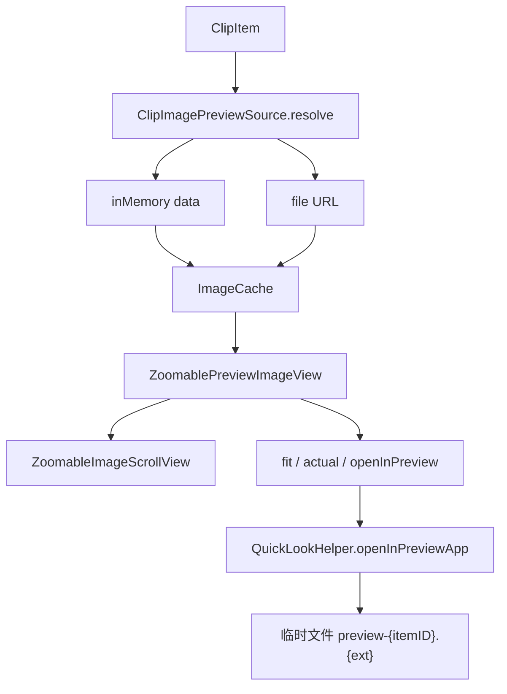

# 图片缩放预览 — 技术实现（tech.md）

> 需求说明见 [spec.md](./spec.md)

## 方案选型

采用 **`NSViewRepresentable` + `NSScrollView`**（`allowsMagnification = true`），与 [`WebPreviewView`](../../Sources/Views/Components/WebPreviewView.swift) 一致。

相对纯 SwiftUI `scaleEffect` 的优势：

- `documentView` 尺寸等于降采样后图片逻辑尺寸，长图天然纵向滚动。
- ⌘+滚轮、捏合由系统处理。

[`AsyncPreviewImageView`](../../Sources/Views/Components/AsyncPreviewImageView.swift) 保留；缩放预览由 [`ZoomablePreviewImageView`](../../Sources/Views/Components/ZoomablePreviewImageView.swift) 承担。

## 架构



## 核心类型

### `ClipImagePreviewSource`

路径：[`Sources/Engine/ClipImagePreviewSource.swift`](../../Sources/Engine/ClipImagePreviewSource.swift)

```swift
enum ClipImagePreviewSource: Equatable {
    case inMemory(data: Data, cacheKey: String)
    case file(url: URL, cacheKey: String)
}
```

解析优先级：

1. `item.sourceImageFileURL`（文件路径单图）
2. `contentType == .image` 且 `imageData != nil`
3. `contentType == .link` 且 `imageData ?? supplementalData != nil`

辅助属性：`ClipItem.isSingleFileBackedImage`、`ClipItem.prefersZoomableLinkImagePreview`。

### `ImageCache` 扩展

路径：[`Sources/Engine/ImageCache.swift`](../../Sources/Engine/ImageCache.swift)

- `preview(forFileAt:url:key:maxDimension:)`
- `previewTask(forFileAt:...)`
- 内部：`ClipboardManager.loadOriginalImageData` → `downsample(data:maxPixelSize: maxDimension * 2)`

| 窗口 | `maxPixelSize` 参数 | 解码最长边约 |
|------|---------------------|--------------|
| 管理器 `ClipDetailView` | 1400 | ~2800px |
| 快捷粘贴 `QuickPreviewPane` | 1100 | ~2200px |

**长图发糊机制**：`ThumbnailMaxPixelSize` 限制最长边后，极高图宽度可能仅百余像素；`applyFitWidth` 再放大到预览区宽度会产生上采样模糊。应用内「100%」是降采样图的 1:1，不是原图像素。

### `ZoomablePreviewImageView`

路径：[`Sources/Views/Components/ZoomablePreviewImageView.swift`](../../Sources/Views/Components/ZoomablePreviewImageView.swift)

- `ZoomableImageScrollView`：`@MainActor` Coordinator，`applyFitWidth` / `applyActualSize`。
- `ZoomLayoutMode`：`.fitWidth` | `.actualSize`，经 `layoutResetToken` 驱动重置。
- 角标工具条 `zIndex(1)`，避免被 `NSScrollView` 挡住点击。
- `ZoomableClipImagePreview`：包装 `ClipItem`，默认 `onOpenInPreview` → `QuickLookHelper.shared.openInPreviewApp`。

初始缩放：

```text
fitWidthScale = clipView.bounds.width / documentView.bounds.width
scrollView.magnification = fitWidthScale
```

`minMagnification = 0.1`，`maxMagnification = 8.0`。

## `QuickLookHelper` — 在预览中打开

路径：[`Sources/Engine/QuickLookHelper.swift`](../../Sources/Engine/QuickLookHelper.swift)

### 问题与修复（截图无法打开）

旧实现将所有内存图片写成 `preview.png`。macOS 剪贴板截图常为 **TIFF**（`capturePasteboardImage` 支持 png/jpeg/heic/tiff），扩展名错误会导致预览.app 静默失败。

### 当前逻辑

```swift
func canOpenInPreview(item: ClipItem) -> Bool {
    prepareURL(for: item) != nil
}
```

`prepareURL` 要点：

| `contentType` | 策略 |
|---------------|------|
| `.image` | 路径存在 → 直接 `file://`；否则 `imageBytesForExport() ?? imageData` → `writeTempImageFile` |
| `.link` | `imageData` 或 `DataImageURI.decodedImageData` → 临时图；纯 URL 返回 `nil` |
| 文件类 | 单路径且 `fileExists` |

`writeTempImageFile`：

```swift
let ext = ClipboardManager.sniffImageExtension(from: data)
// preview-{itemID}.{ext}  例如 .tiff / .heic / .jpg
```

`openInPreviewApp`：优先 `com.apple.Preview`；失败时 `NSWorkspace.shared.open(url)`。

与 Quick Look 分工：

| API | 用途 |
|-----|------|
| `toggle` / `preview` | Quick Look 浮层（空格、快捷粘贴 ⌘O） |
| `openInPreviewApp` | 预览.app（工具条眼睛、快捷粘贴双击、⌘K） |

## 集成点

| 文件 | 改动 |
|------|------|
| [`ClipDetailView.swift`](../../Sources/Views/Main/ClipDetailView.swift) | `zoomableImagePreview`；`contentPreview` / `linkPreview` 位图分支；`decodedLinkImageData` 异步解码 data URI |
| [`QuickPreviewPane.swift`](../../Sources/Views/QuickPanel/QuickPreviewPane.swift) | `ZoomableClipImagePreview`；单路径文件图；`dataURIImagePreview`；双击 → `openInPreviewApp` |
| [`CommandPaletteView.swift`](../../Sources/Views/QuickPanel/CommandPaletteView.swift) | `canOpenInPreview` 委托 `QuickLookHelper`（与 `prepareURL` 一致） |

## L10n

| Key | 用途 |
|-----|------|
| `preview.image.zoomFit` | 适应宽度（工具条） |
| `preview.image.zoomActual` | 100%（工具条） |
| `preview.image.openInPreview` | 在预览中打开（工具条） |
| `preview.image.zoomHint` | 工具条胶囊帮助 |
| `cmd.openInPreview` | 命令面板项（⌘K 内 L） |

11 个 `Sources/Localization/*.lproj/Localizable.strings`。

## 改动文件清单

**新建**

- `docs/image-zoom-preview/spec.md`
- `docs/image-zoom-preview/tech.md`
- `Sources/Engine/ClipImagePreviewSource.swift`
- `Sources/Views/Components/ZoomablePreviewImageView.swift`

**修改**

- `Sources/Engine/ImageCache.swift`
- `Sources/Engine/QuickLookHelper.swift` — 正确扩展名、导出字节、链接图、`canOpenInPreview` 与 `prepareURL` 对齐
- `Sources/Views/Main/ClipDetailView.swift`
- `Sources/Views/QuickPanel/QuickPreviewPane.swift`
- `Sources/Localization/*.lproj/Localizable.strings`（×11）
- `Tests/PasteMemoTests.swift` — `openInPreviewSupportedTypes` 使用有效 PNG 头

## 测试计划

1. `swift build` / `make build`
2. `swift test` — 含 `openInPreviewSupportedTypes`
3. 手动验收：见 [spec.md 验收标准](./spec.md#验收标准)，重点：
   - ⌘⇧截图 → 眼睛图标 / 双击 → 预览.app 能打开
   - 长图应用内滚动 + 预览.app 对比清晰度
4. 可选后续：
   - `ClipImagePreviewSource.resolve` 单元测试
   - 长图预览按宽度降采样或分级加载

## 与仓库文档惯例

本目录 `docs/image-zoom-preview/` 为权威说明。可选同步 `docs/superpowers/specs/2026-05-18-image-zoom-preview-design.md` 命名风格；实现计划 `docs/superpowers/plans/2026-05-18-image-zoom-preview.md` 可选。
