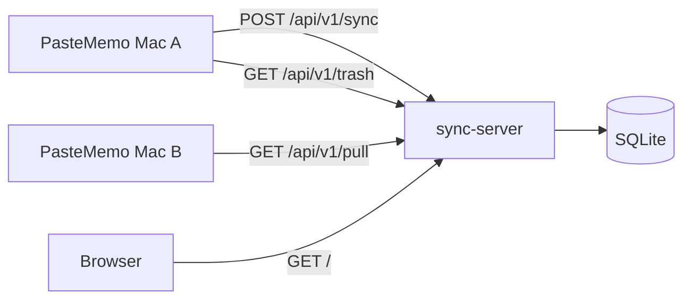

# PasteMemo Sync Server

Self-hosted sync server for [PasteMemo](https://github.com/lifedever/PasteMemo-app). Multiple macOS clients share clipboard history through a central SQLite store, authenticated with a single Bearer token.

## Architecture



- **Push**: each client uploads new local clips incrementally (`created_at` newer than last successful sync).
- **Pull**: clients download clips from selected peer devices (other `client_id` values on the same server).
- **Trash sync**: soft-deleted items propagate to other devices; the server permanently purges trash older than **10 days** (hourly background job).
- **Server**: validates token on sync APIs, stores items idempotently by `(client_id, item_id)`, tracks per-client IP/hostname and sync stats.
- **Dashboard**: embedded HTML at `/` lists connected clients and lets you browse synced items (with optional in-browser decryption).

## Requirements

- Go 1.22+ (module targets Go 1.25)
- Writable path for the SQLite database

## Configuration

| Variable | Required | Default | Description |
|----------|----------|---------|-------------|
| `SYNC_TOKEN` | yes | — | Shared Bearer token for all clients |
| `SYNC_LISTEN_ADDR` | no | `:8787` | HTTP listen address |
| `SYNC_DB_PATH` | no | `./sync.db` | SQLite database file |
| `SYNC_TRUST_PROXY` | no | `false` | Trust `X-Forwarded-For` / `X-Real-IP` for client IP |

## Build & Run

```bash
cd sync-server
go build -o sync-server ./cmd/sync-server/

export SYNC_TOKEN='change-me-to-a-long-random-string'
./sync-server
```

Server listens on `http://0.0.0.0:8787` by default.

## Authentication

| Endpoints | Auth |
|-----------|------|
| `POST /api/v1/sync`, `GET /api/v1/pull`, `GET /api/v1/trash`, `DELETE /api/v1/clients/{clientID}/items` | **Bearer token required** |
| `GET /healthz`, `GET /`, `GET /api/v1/clients`, `GET /api/v1/types`, `GET /api/v1/items`, item read/delete/restore APIs | **No auth** (see [Security Notes](#security-notes)) |

All authenticated requests use:

```http
Authorization: Bearer <SYNC_TOKEN>
```

## API

### `GET /healthz`

Returns `{"status":"ok"}`.

### `POST /api/v1/sync`

Upload a batch of clips from one device.

Headers:

```http
Authorization: Bearer <SYNC_TOKEN>
Content-Type: application/json
```

Body (simplified):

```json
{
  "client_id": "uuid",
  "hostname": "My-Mac",
  "sent_at": "2026-06-25T08:00:00.000Z",
  "encryption": {
    "enabled": true,
    "key_fingerprint": "sha256-hex",
    "salt": "base64"
  },
  "items": [
    {
      "item_id": "clip-uuid",
      "created_at": "2026-06-25T07:55:00.000Z",
      "last_used_at": "2026-06-25T07:56:00.000Z",
      "content": "hello",
      "content_type": "text",
      "source_app": "Safari",
      "is_favorite": false,
      "is_pinned": false,
      "is_sensitive": false,
      "truncated": false,
      "encrypted": false
    }
  ]
}
```

Items may also include metadata fields (`display_title`, `ocr_text`, `image_data_base64`, `origin_client_id`, etc.) and encrypted payloads (`encrypted: true`, `payload_encrypted`).

- Request body limit: **512 MiB**.
- Duplicate `(client_id, item_id)` pairs are ignored and counted in `deduped_count`.

Response:

```json
{
  "accepted_count": 1,
  "deduped_count": 0,
  "server_time": "2026-06-25T08:00:01.000Z"
}
```

### `GET /api/v1/pull`

Pull clips from a peer device (used by PasteMemo for multi-device sync).

Query parameters:

| Parameter | Required | Description |
|-----------|----------|-------------|
| `client_id` | yes | Source device to pull from |
| `since` | no | Only items with `created_at` after this RFC3339 timestamp |
| `limit` | no | Page size (default 30, max 100) |
| `cursor_created_at`, `cursor_item_id` | no | Pagination cursor from previous response |

Response: `{ "items": [...], "has_more": bool, "next_cursor": { "created_at", "item_id" } }` — `items` use the same shape as sync upload payloads.

### `GET /api/v1/trash`

List soft-deleted item IDs for trash propagation.

Query parameters:

| Parameter | Required | Description |
|-----------|----------|-------------|
| `client_id` | yes | Device whose trash to list |
| `since` | no | Only deletions with `deleted_at` after this timestamp |
| `limit` | no | Page size (default 30, max 100) |
| `cursor_deleted_at`, `cursor_item_id` | no | Pagination cursor |

Response: `{ "items": [{ "item_id", "deleted_at" }], "has_more", "next_cursor" }`.

### `DELETE /api/v1/clients/{clientID}/items`

Wipes **all** items for a client (Bearer auth). Used when encryption settings change in the app.

Response: `{ "deleted_count": N }`.

### `GET /api/v1/clients`

JSON list of connected clients (same fields as the dashboard): `client_id`, `last_ip`, `last_hostname`, sync counts, `item_count`, encryption metadata.

### `GET /`

HTML dashboard: client list, browse synced items per client, type filter, trash view, infinite scroll.

- **All types / non-image**: list cards with preview; click for detail modal.
- **Image type**: waterfall (masonry) grid; lazy-loaded images; scroll to load more.
- **Encrypted clients**: show 🔒; browsing requires the passphrase (Web Crypto, same `PMEM` format as app export).

### `GET /api/v1/types?client_id=...`

Returns the fixed list of all known `content_type` values (matches app `ClipContentType`, no DB query): `{ "types": ["application", "archive", "audio", "code", ...] }`.

### `GET /api/v1/items?client_id=...&type=...&limit=30&cursor_created_at=...&cursor_item_id=...`

Paginated item summaries. Add `trash=1` to list soft-deleted items.

Response: `{ "items": [...], "has_more", "next_cursor" }`.

### `GET /api/v1/items/{client_id}/{item_id}`

Full item metadata (no raw binary blobs; flags like `has_image` indicate attachments).

### `GET /api/v1/items/{client_id}/{item_id}/image`

Image bytes for thumbnails / grid view. On macOS the server transcodes TIFF/HEIC to JPEG when possible; unsupported formats return `415`.

### `DELETE /api/v1/items/{client_id}/{item_id}`

Soft-delete an item (sets `deleted_at`).

### `POST /api/v1/items/{client_id}/{item_id}/restore`

Restore a soft-deleted item.

### `DELETE /api/v1/clients/{client_id}/trash`

Permanently delete all trashed items for a client.

## PasteMemo Client Setup

1. Open **Settings → Sync**.
2. Set **Server URL** (e.g. `http://127.0.0.1:8787`).
3. Set **Token** (same value as `SYNC_TOKEN`).
4. Optional: enable automatic sync, set interval (default 5 minutes) and batch size (default 20).
5. Under **Sync from devices**, select peer Macs to pull clips from.
6. Optional: enable **Encryption** and set a passphrase (clips are encrypted client-side before upload).
7. Click **Sync Now** for a manual run.

On sync failure, automatic sync pauses until you click **Resume automatic sync**.

Each Mac has a unique **Client ID** (regenerating it starts a fresh identity on the server).

## Reverse Proxy (optional)

Example Caddy:

```caddy
sync.example.com {
    reverse_proxy 127.0.0.1:8787
}
```

When behind a proxy, set `SYNC_TRUST_PROXY=true` so client IPs are taken from `X-Forwarded-For`.

## Data & Backup

All data lives in the SQLite file (`SYNC_DB_PATH`). Back up that file regularly.

Tables:

- `clients` — per-device sync metadata and encryption fingerprints
- `items` — clip payloads (text, blobs, encrypted ciphertext)

Trash items keep a `deleted_at` timestamp and are permanently removed after **10 days**.

## Encryption (client-side)

PasteMemo encrypts clip payloads with **AES-GCM** before upload when encryption is enabled. The server stores ciphertext and publishes a **key fingerprint** (SHA-256 of the derived AES key) plus **PBKDF2 salt** on the client record — never the passphrase or raw key.

- `POST /api/v1/sync` accepts optional `encryption: { enabled, key_fingerprint, salt }` and encrypted items (`encrypted: true`, `payload_encrypted`).
- `DELETE /api/v1/clients/{clientID}/items` (Bearer auth) wipes all items for a client when encryption settings change.
- Web dashboard: encrypted clients show 🔒; browsing requires the passphrase to decrypt in the browser.

When toggling encryption or changing the passphrase in the app, the client deletes server items for its `client_id`, resets sync watermarks, and re-uploads.

## Security Notes

- Use **HTTPS** in production.
- Choose a long random `SYNC_TOKEN`.
- The dashboard (`/`) and read/delete item APIs are **unauthenticated**. Do not expose them publicly without additional protection (VPN, IP allowlist, or an auth layer in front of the proxy) if that is a concern.
- Sync APIs (`/api/v1/sync`, `/api/v1/pull`, `/api/v1/trash`) require the Bearer token.
