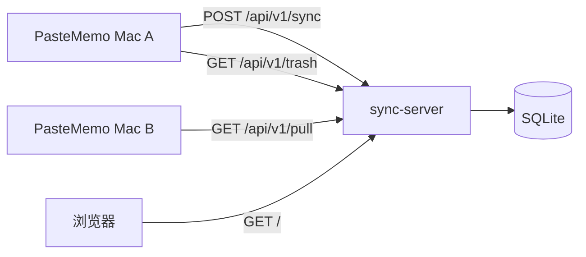

# PasteMemo 同步服务器

[PasteMemo](https://github.com/lifedever/PasteMemo-app) 的自托管同步服务。多台 macOS 客户端通过统一的 Bearer Token 连接中央 SQLite 数据库，共享剪贴板历史。

## 架构



- **推送（Push）**：各客户端增量上传本地新剪贴项（`created_at` 晚于上次成功同步时间）。
- **拉取（Pull）**：从所选的对等设备（同一服务器上的其他 `client_id`）下载剪贴项。
- **回收站同步**：软删除会传播到其他设备；服务器每小时清理 **超过 10 天** 的回收站记录。
- **服务端**：对同步 API 校验 Token，按 `(client_id, item_id)` 幂等存储，记录每台设备的 IP/主机名及同步统计。
- **控制台**：`/` 提供内嵌 HTML 页面，可浏览已同步内容（支持浏览器内解密）。

## 环境要求

- Go 1.22+（模块目标版本为 Go 1.25）
- 可写的 SQLite 数据库路径

## 配置

| 环境变量 | 必填 | 默认值 | 说明 |
|----------|------|--------|------|
| `SYNC_TOKEN` | 是 | — | 所有客户端共用的 Bearer Token |
| `SYNC_LISTEN_ADDR` | 否 | `:8787` | HTTP 监听地址 |
| `SYNC_DB_PATH` | 否 | `./sync.db` | SQLite 数据库文件路径 |
| `SYNC_TRUST_PROXY` | 否 | `false` | 是否信任 `X-Forwarded-For` / `X-Real-IP` 获取客户端 IP |

## 编译与运行

```bash
cd sync-server
go build -o sync-server ./cmd/sync-server/

export SYNC_TOKEN='change-me-to-a-long-random-string'
./sync-server
```

默认监听 `http://0.0.0.0:8787`。

## 认证说明

| 接口 | 认证 |
|------|------|
| `POST /api/v1/sync`、`GET /api/v1/pull`、`GET /api/v1/trash`、`DELETE /api/v1/clients/{clientID}/items` | **需要 Bearer Token** |
| `GET /healthz`、`GET /`、`GET /api/v1/clients`、`GET /api/v1/types`、`GET /api/v1/items`、条目读写/恢复接口 | **无需认证**（见[安全说明](#安全说明)） |

需要认证的请求均使用：

```http
Authorization: Bearer <SYNC_TOKEN>
```

## API

### `GET /healthz`

返回 `{"status":"ok"}`。

### `POST /api/v1/sync`

从一台设备上传一批剪贴项。

请求头：

```http
Authorization: Bearer <SYNC_TOKEN>
Content-Type: application/json
```

请求体（简化示例）：

```json
{
  "client_id": "uuid",
  "hostname": "My-Mac",
  "sent_at": "2026-06-25T08:00:00.000Z",
  "encryption": {
    "enabled": true,
    "key_fingerprint": "sha256-hex",
    "salt": "base64"
  },
  "items": [
    {
      "item_id": "clip-uuid",
      "created_at": "2026-06-25T07:55:00.000Z",
      "last_used_at": "2026-06-25T07:56:00.000Z",
      "content": "hello",
      "content_type": "text",
      "source_app": "Safari",
      "is_favorite": false,
      "is_pinned": false,
      "is_sensitive": false,
      "truncated": false,
      "encrypted": false
    }
  ]
}
```

条目还可包含元数据字段（`display_title`、`ocr_text`、`image_data_base64`、`origin_client_id` 等）及加密载荷（`encrypted: true`、`payload_encrypted`）。

- 请求体上限：**512 MiB**。
- 重复的 `(client_id, item_id)` 会被忽略，计入 `deduped_count`。

响应：

```json
{
  "accepted_count": 1,
  "deduped_count": 0,
  "server_time": "2026-06-25T08:00:01.000Z"
}
```

### `GET /api/v1/pull`

从对等设备拉取剪贴项（PasteMemo 多设备同步使用）。

查询参数：

| 参数 | 必填 | 说明 |
|------|------|------|
| `client_id` | 是 | 要拉取的源设备 ID |
| `since` | 否 | 仅返回 `created_at` 晚于该 RFC3339 时间戳的条目 |
| `limit` | 否 | 每页条数（默认 30，最大 100） |
| `cursor_created_at`、`cursor_item_id` | 否 | 上一页响应中的分页游标 |

响应：`{ "items": [...], "has_more": bool, "next_cursor": { "created_at", "item_id" } }`，`items` 结构与上传载荷相同。

### `GET /api/v1/trash`

列出软删除的条目 ID，用于回收站同步。

查询参数：

| 参数 | 必填 | 说明 |
|------|------|------|
| `client_id` | 是 | 要查询的设备 ID |
| `since` | 否 | 仅返回 `deleted_at` 晚于该时间戳的删除记录 |
| `limit` | 否 | 每页条数（默认 30，最大 100） |
| `cursor_deleted_at`、`cursor_item_id` | 否 | 分页游标 |

响应：`{ "items": [{ "item_id", "deleted_at" }], "has_more", "next_cursor" }`。

### `DELETE /api/v1/clients/{clientID}/items`

删除某客户端的**全部**条目（需 Bearer 认证）。应用在更改加密设置时调用。

响应：`{ "deleted_count": N }`。

### `GET /api/v1/clients`

以 JSON 返回已连接客户端列表（字段与控制台一致）：`client_id`、`last_ip`、`last_hostname`、同步计数、`item_count`、加密元数据等。

### `GET /`

HTML 控制台：客户端列表、按设备浏览同步内容、类型筛选、回收站视图、无限滚动。

- **全部类型 / 非图片**：卡片列表预览，点击查看详情。
- **图片类型**：瀑布流网格，懒加载，滚动加载更多。
- **加密客户端**：显示 🔒；浏览需在浏览器输入口令解密（Web Crypto，与 App 导出加密格式 `PMEM` 一致）。

### `GET /api/v1/types?client_id=...`

返回所有已知 `content_type` 的固定列表（与 App 的 `ClipContentType` 一致，不查库）：`{ "types": ["application", "archive", "audio", "code", ...] }`。

### `GET /api/v1/items?client_id=...&type=...&limit=30&cursor_created_at=...&cursor_item_id=...`

分页返回条目摘要。加 `trash=1` 可列出已软删除的条目。

响应：`{ "items": [...], "has_more", "next_cursor" }`。

### `GET /api/v1/items/{client_id}/{item_id}`

返回完整元数据（不含原始二进制；`has_image` 等标志表示附件）。

### `GET /api/v1/items/{client_id}/{item_id}/image`

返回图片字节，供缩略图/网格使用。macOS 上服务端会尽量将 TIFF/HEIC 转码为 JPEG；不支持的格式返回 `415`。

### `DELETE /api/v1/items/{client_id}/{item_id}`

软删除条目（设置 `deleted_at`）。

### `POST /api/v1/items/{client_id}/{item_id}/restore`

恢复软删除的条目。

### `DELETE /api/v1/clients/{client_id}/trash`

永久清空某客户端回收站中的所有条目。

## PasteMemo 客户端配置

1. 打开 **设置 → 同步**。
2. 填写 **服务器地址**（如 `http://127.0.0.1:8787`）。
3. 填写 **Token**（与 `SYNC_TOKEN` 相同）。
4. 可选：开启自动同步，设置间隔（默认 5 分钟）和批次大小（默认 20）。
5. 在 **从以下设备同步** 中选择要拉取内容的对等 Mac。
6. 可选：开启 **加密** 并设置口令（上传前在客户端 AES 加密）。
7. 点击 **立即同步** 手动触发。

同步失败时，自动同步会暂停，需点击 **恢复自动同步** 继续。

每台 Mac 有唯一的 **客户端 ID**（重新生成后会在服务器上视为新设备）。

## 反向代理（可选）

Caddy 示例：

```caddy
sync.example.com {
    reverse_proxy 127.0.0.1:8787
}
```

置于代理之后时，设置 `SYNC_TRUST_PROXY=true`，以便从 `X-Forwarded-For` 读取客户端 IP。

## 数据与备份

所有数据存放在 SQLite 文件（`SYNC_DB_PATH`）中，请定期备份。

表结构：

- `clients` — 每台设备的同步元数据及加密指纹
- `items` — 剪贴项载荷（文本、二进制、加密密文）

回收站条目带有 `deleted_at` 时间戳，**10 天**后由服务端永久删除。

## 加密（客户端侧）

开启加密后，PasteMemo 在上传前用 **AES-GCM** 加密剪贴载荷。服务端只存密文，并在客户端记录上发布 **密钥指纹**（派生 AES 密钥的 SHA-256）和 **PBKDF2 盐** — 从不存储口令或原始密钥。

- `POST /api/v1/sync` 可携带 `encryption: { enabled, key_fingerprint, salt }` 及加密条目（`encrypted: true`、`payload_encrypted`）。
- `DELETE /api/v1/clients/{clientID}/items`（Bearer 认证）在更改加密设置时清空该客户端全部条目。
- Web 控制台：加密客户端显示 🔒；浏览需输入口令在浏览器内解密。

在 App 中开关加密或修改口令时，客户端会删除服务器上该 `client_id` 的全部条目、重置同步水位并重新上传。

## 安全说明

- 生产环境请使用 **HTTPS**。
- `SYNC_TOKEN` 应使用足够长的随机字符串。
- 控制台（`/`）及条目读取/删除 API **无需认证**。若存在隐私顾虑，请勿直接公网暴露，可配合 VPN、IP 白名单或代理层鉴权。
- 同步 API（`/api/v1/sync`、`/api/v1/pull`、`/api/v1/trash`）需要 Bearer Token。
